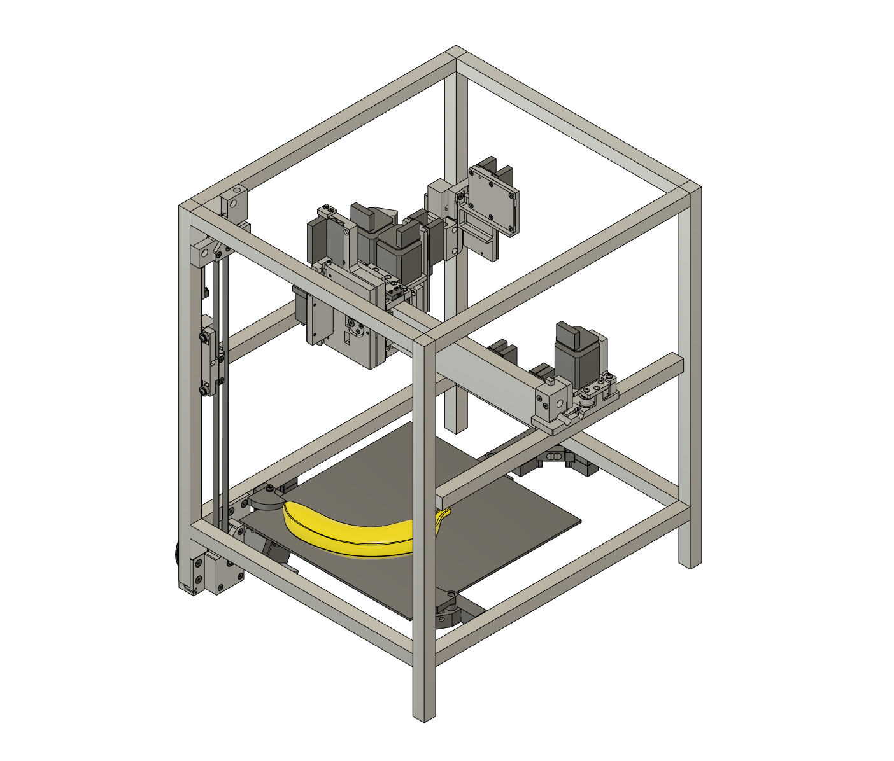

## Clank-FXY 

This is the CAD repo for the "tall" variant of the [clank](https://clank.tools) machine platform: easily fabricated, multi-purpose cnc tools. Part of the [mtm project](mtm.cba.mit.edu) at the [MIT Center for Bits and Atoms](cba.mit.edu)

Read the [dev log](log/clank-fxy-log.md) for updates, and find the [most up to date CAD in /cad](cad). More documentation is at [clank.tools/build/flyingxy](https://clank.tools/build/flyingxy). 

This repo is mirrored [on github](https://github.com/jakeread/clank-fxy/) and the [cba internal gitlab](https://gitlab.cba.mit.edu/jakeread/clank-fxy).