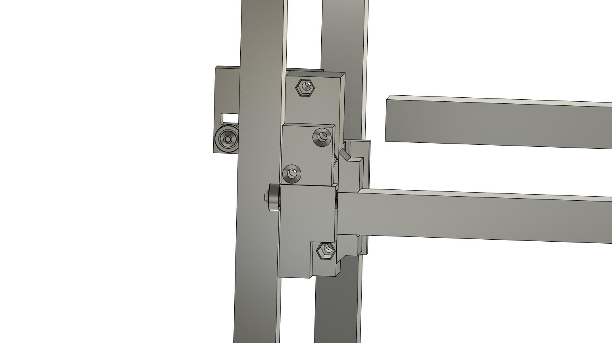

## Clank / Flying XY 

aka bougie clank

## 2021 04 15 

Have some sketches from a moment I was considering this some time ago... 

It's a somewhat awkward proposition. Kinematics are some kind of mess. If I do this right, though, I can just mirror both sides. 

The motivation here is to have a stronger "general purpose" platform, where we aren't lifting the bed. If we lift the whole XY stage, we can carry more tools on the front face, get a solid "bed" (since in any case I am wanting to be able to i.e. hot swap in modular beds also ... and might i.e. want relatively chunky vacuum chucks, etc). 

The move, as far as I can tell, is to do this with four motors (!) for the z, each with a small reduction, and pulleys to lift. This seems kind of hare-brained and it might be, but I'm attracted to it. This means lots of torque to lift the relatively heavy stage (so big z accels), and with the four motors we have the potential to software-tram the stage. This is also why I want to get it into a fairly kinematically friendly situation: we might even be able to get a few degrees of swarf in, enough to maybe put a tapered wall on a mould / otherwise do minor swarf cutting. That would be a neat trick, but more important might be having adjustable tramming on various tools. 

### Layout 

So! On with it, we need a layout. I had originally worried that adding this would stretch the footprint, but clank lately has this monster brace anyways:

So I think I have the room if I squeeze the vertical rails up here, that'll even give me a somewhat-ideal space to land tools on. 

I also want to adjust the travel to have 300mm squared... that'll be variable / parametric though. 

Certainly the first debate is whether to load these motors above / below the frame. Loading them up top makes immediate sense as I need a load of frame clearance up here for the Y motors anyways:

Loading them up top also means I can likely reclaim some desk space... and the motors won't be hidden from view for i.e. debugging. Also... we'll want to "home" up, and if I use limit switches this is where I'd want them... limit switch cables attached to motor drivers. 

I suspect that I want lots of z torque, it'd be a shame to run out. 

So, 1:5 reduction should net me (with a 20T output, 0.5Nm of motor torque) 20kgf of z-left per corner, I'll assume that's plenty. 

I think this is the layout move:

It's a little tucked in the corner, motor controller faces out. This overhangs the frame a little bit, but so will tool butts. This will allow me to make a pretty stiff joint by clamping both sides of that extrusion, and leaves the belt out in the open to test tension / adjust / clamp.

Having debates about where to put the z guides. Also about how many: do I need to constrain these rails in the XZ plane, rotation? Probably best to do so. 

I think this is enough layout, I should get into detail design on the z guides first, then move to the z drives. Key detail will be the z-drive belt pickup at the guides. 

I think actually the grunt of the work here will be detailing the cable guides, circuit mounts, etc... outside of just the mechanics. 

## 2021 04 16 

Ah yeah I was wrong, this is the way:

I think the inside corner is important as this is where the load lands on the Y rails. I can squeeze this in where there is dead space anyways, and now the motors are inboard of the frame. 

### Y-Front / Y-Rear Z Guides

OK, have some progress on the front z-belt clamp / etc. 

Have this y-left-front piece:

I think it works out pretty well... manage to dodge everything past eachother. Belt clamps seem sturdy. 

So then, on with the y-left-rear, which will be a bit trickier as it does the Y constriant, needs to reach around. 

But, also, let me say, the way this z-belt clamp has worked out is splended, bless. 

OK, y-left-rear isn't so bad:

One thing I don't like is the distance between the y-constraining bearings and the y-rails on the YLR, this makes for some flexy plastic in the load path:

I can likely coordinate to skewer that bearing with the y-belt clamp hold-down bolt. This is probably worth somewhere ~ 2x the stiffness through this element (as I'm halving the cantilever... probably more then). So that's worth it. 

... I could even make the y-constraint mate the same chunk of plastic as the belt clamp? This seems kind of insane, until we remember that the belt is one of the main load paths. But only really in the tensile case, in the other the load traverses through the *other* side of the belt, back through the rail. 

Alright, this is much better force-alignment:

OK, I lined some offsets up again for the XY section, that's "done" here and I'm exporting a copy of the fusion assembly, here: [2021-04-16_clank-fxy-xy-v9.f3z](../cad/2021-04-16_clank-fxy-xy-v9.f3z)

### Z-Drives

Alright, onto these z-drives now. 

If I pick a 200mm belt (which are widely available) I can reduce 4.5:1, which is ostensibly 18kgf, but I think we all know I'm going to want "lots" of torque.

Going for 125:20 / 6.25:1, spreadsheet says 25kgf, this is surely *enough* and might be the right amount. Famous last words, though. 

So I'm more or less finished with this unit, surprisingly fast. 

 

I certainly want to mount this a little better, think I want a flange out to the right, into the other corner. 

Alright;

### Frame Setup

I'm shockingly ready to setup a frame / full model. Then I just have the z-drive idlers / tensioners to draw. 

I'm tempted to note that this is actually simpler in a few ways than the cantilevered-z (CZ) model. That's awesome. I need z-drive idlers now... those will also be feet. Then it's detail city: cable routing, the notes below, etc. 

Have a bottom idler, thing is ~ 620mm tall now. Need to dial actual z-travel. 

## 2021 04 19 

I'm trying to get the floor / bed kinematic mount laid out here. I like this idea of having three loadcells down here, but mechanically it's a bit of a struggle... though ostensibly still better than getting them into the x carriage. Although perhaps the move is mounting them each in-line with drivetrains / belts... IDK what the answer is. They're going in the floor for now. 

For some reason getting these loadcells is always a big design foil for me. I suppose it's since we are having to concentrate a load path through a relatively tiny thing. 

Ah, I have this thing:

But - what I couldn't see in the subassembly - I can maybe do this better if I put the loadcell at the junction between the bed subframe and the machine frame, at this junction here: 

 

Then the kinematic mount can stay relatively stiff, and modifying the frame-to-frame connect to be either floating / loadcell'd or stiff will be straightforward. 

This is a nice, simple subassembly and should be "stiffish" - most of the loadpath direct through shear loads in the print, minimal bending. I can just use three of these also. Also - if I want a stiff machine and don't care for the load measurement, I can simply replace this joint with a frame bracket. 

So, need to make the subframe / kinematic mounts on the bed still. 

## 2021 04 20 

Mostly errands today, but I'm tidying this up and nearly through. Just need a mounting location for the bed heater now. Also all of these remaining items... but I am probably ready to get the misumi order in, though I still might want to cuten it up w/ 256mm build volume. 

## 2021 04 21 

OK, going to methodically work through the remainder of this design. It's all very close. 

First, need a mount for the heater module. 

Alright, now the choice for 305mm (just larger than 12") or 256mm (10") dimensions. Current travel on Clank-CZ is ~ 250, and I suspect that's about 3 tools across (80mm width each). Not a lot of breathing room there though. 305mm wouldn't increase the number of tools. Also, the bed has some dead space at the edges to respect anyways. 

For reference, voron does 250x250x230, with frame size 410x410x430. Here we're looking at:

| Printer | XYZ | FXYZ | Offsets |
| --- | --- | --- | --- |
| Voron 2 | 250x250x230 | 410x410x430 | 160x160x200 |
| Clank FXY | 305x305x305 | 475x515x615 | 170x210x310 |

So, not very squished, relative. The toolchanger certainly doesn't help. I think I am going to pinch it to 256mm volume, it keeps things in this "cute" regime and, anyways, I don't anticipate wanting to do any bigger FDM printing on the regular. 

So - tightening this up.

OK, z-travel / endstops. Y/X Endstops. Need to find a switch... things should home *away from 0,0* I think - clearing out  space for the human. 

Might be D3V Omron switches. OK, more like `D3M-01K3-3` - smaller, cable connected. Nope, KISS, right - here's the simplest: `SS-01-E-2` or digikey PN `Z5042-ND` 

OK, I have relatively simple limits on XY. These will just plug into some pin on the motor controllers, I'll run "home" on each motor... and query against some "homed" endpoint... returning true if it's been done during that power cycle of the motor. 

So I need limits on each z axis, oy. I also need to set the height. 

OK, solved that with a stop block into the extrusion. 

So - this is all done then, should tidy my lists and see what's next. I think perhaps it's just cable routing, print setup... 

I have this trap with the thickness of the Z guides, which, when the Y rail is flush against the face, are thicker than the YL / YR guides. By 2.125mm... This means I have some interference when the machine is near 0,0 - like this:

I could bump the thickness of these YL / YR plates by the 2.125mm for "clean" set of overlaps. The loss is 5mm of offset, the win is some added stiffness and this kind of ... cleanliness? IDK. I could just as easily do this in software as well. 

I will say the YL / YR assemblies are by far the messiest. But I think I have these sorted. 

With most of the offsets buttoned up then, I ostensibly just have cable routing to sort out. 

### Cable Routing

There is a nice space here in the rear of the machine... I figure the 30-pin IDCs can make a great "cable chain" and I aught to just pin it down in a few spots. 

I think I can fit a bundle in right behind the x motor. Tempted to also make a new cable endpoint board. I want to add some support here anyways to make the x motor diving board stiffer. 

But for now I think I can get away with some pretty lazy routing. I'll stick one of these things on the x motor, but will ignore the rest for the time being. I want to get through more code / etc before trying to really get tidy. 

OK, thing is done. 

## 2021 04 29

Building one of these today

- M2 on limits
    - use 20mm M2, get thru to flush-ish, no hex drop
    - generous on hex offset, add 0.1mm on total width (?) and chamfer 
- YL has M3 SHCS at motor mount interference with rear idler pulley, on 'loosest' setting 
- YL / YR messy, maybe think about improvement / fresh start ? 
- fully didn't think abt framing brackets 
    - reshape z-guides to claim dead z-space on bottom, match to bottom of YL / YR 
    - some way to bring corners snugly together, ends tapped ? worth it ? idk 
    - the frame *fully* requires these corner braces, on all four - has a serious DOF here 
- z drives have some belt : SHCS interference, is OK but could be maneouvered to get better... twist the motor a bit 
- z-drive bottom corners not to easy to get on / setup 

I think there are maybe some tricks to pull around the corners. Mostly, it is not obvious how to get things all squared up in any of the frame corners - and this 'dead zone' on the posts is not doing anything. 

There is also the more generalized problem that the braces delete some z-travel, though I suspect some of this could be gained back with modified z-guides. 

## 2021 05 03 

Well, would like to have clank-fxy singing by the end of the month. For now I'm in a small redesign of the z-drives. The biggest update is that I was completely not thinking about framing, which is a bigtime oof... so that's on for today. 

So this is where it's, like, time to weep my dudes: the z belt currently runs in-line w/ the braces. Given that we have also this struggle at the bottom w/ the z guides touching off on the braces, I think the only reasonable move here is to move the whole z-drives (top and bottom) to be interior to the frame. This will amount to a pretty hearty redesign, but that's big shrugman. Gotta do it. 

So, a list of mods:

- redux z drive to sit underneath, 
    - motor back is new X limit, watch 
    - now can incorporate Z limit switch ? 
    - can get stiffer / simpler w/ spanning grip 
- redux z idler 
- new frame geometry, empty / foot corners, to 'pinch together' frame during assembly 
- notes above / other odds & ends 

The z-drive is a struggle here actually; unless I stick the pulley out of the frame (in X dir) I am now limited in driven belt size ~ pd of 42mm, for # teeth ~ 65 teeth, say 60, with 20 on the pinion for 1:3, netting 12kgf of linear oomf, where previously I was spec'd to do 25. I am convinced this is still enough, and I should try it - I was previously running a smaller overall linear force (same drive reduction, larger final pinion), for about the same weight. It was marginal but now there are four of these... however there are certainly cases where the majority of the load is on one of the motors. 

From other work, though, I know I am also approaching the GT2 limit at the final drive: the pulley will slip around 1.5Nm, where I am pulling 3:1 reduction on a motor that is likely 0.5Nm - so I suspect it's marginal here anyways. Indeed I should bring the final drive size up (!). If I bump the motor pinion to 16t and the output pinion to 28t (for 2.1Nm slip torque), I can get 10kgf and stay 'inside'. 

That's the move, then, and I should recall here that belt tension will be critical. Given the desire to tighten up the bottom, might be the move to get the tensioner inline w/ the motor unit. It's a fun trick anyways. 

Oddly the lower / idler is more difficult. 

## 2021 05 05 

Lower idler! 

Have a new z drive system:

 

Lower idler is a bit of a tricky flexure (flexure's not tricky, space maneouvering is)

IDK how well this will work, we'll see. It will do tracking and tension, I don't really like the size of that beam though for stiffness. On that thought, I'm going to beef it up a bit. 

Z-Guide bottoms, which I thought I could tune down, suffer topologically from the 5mm shrink, I besides have to hoist the bed up a ways (45mm) for the swing-out clips to clear these new z lower idlers. 

I will say this debacle has brought some chaos overall. I see that the voron deals with this frame stiffness question with external braces. 

I have to deal with some new interference also between the bed mount and idlers. 

Alright I think now the remainder is the new bed / loadcell mounts, and some details. Tomorrow. 

## 2021 05 07 

I think I just have the bed oddities now, and some details throughout. 

Two of these... 

Second seems much better to me. 

It would be cool if there were a straightforward of constraining in the KM bed from below, rather than dealing with these big overhanging clips. 

Alright somewhat to my surprise these revisions are done, so I can setup final prints. 

## 2021 05 13 

Assembling again, notes:

- z drive thickness is awkward for pulley / set screw land
    - maybe add some mm to the rear, move pulley center line further from motor 
- oof lorde *other side* of the pulley is of course in line here... 
    - surely there is a hotfix, but this might warrant a more involved rethink  

Well, wow. Frustrated that I've missed two critical pieces here, I guess that's what happens when you rush a project. I think the solution is like:

- extend the z-guides to take up this belt offset
- move the y limit switches to contact not at the belt clamp, but at the z-guide at the top of the y rails

This is a ~ day (or half) of CAD, and maybe similar print / reassembly. It might be worth getting the current revision online though, to see how the z holds up under accelerations etc. That'll also get me through homing routines on X and Z, can extend to Y after the rebuild / redesign. 

## 2021 05 20 

I've the z together now, and it seems like a fairly workable solution. I am going to run through my updates and also see about *another* new bed clamp design (though maybe the update comes after I can do i.e. software bed levelling). 

- model the belt 
- consider a larger change to the bottom half,  
    - bb wants a potentially very stiff bed mount 
- increase ZLF / ZLR to touch off with no belt contact
- move limit on YL / YR, same (?) 
    - remodel YL / YR ? you want it 
    - tidy / include some limit wiring organizers, esp. to keep out of way of where limits are made 

I am thinking that I don't really like this Z idler setup, and the corner crowding overall. To start, I can move corner pieces to outside angles, making it possible to clean up the interior face corners. The top / bottom face squareness is a bit more difficult - but I think I have more design DOF than I had originally considered, and should take some time here. Probably into Rhino then... 

So I can totally rework corners with a move like this:

 

Then I am loosing ~ 30mm in front and back (where I anyways think I want the cable routing space (in the back) and need the tool hangup space (in the front)). Moving the z-pulley elements above the top frame plane cleans up z motors in the way of cable routing, and beneath it clears way to drop the bed back to be in-line with the lower frame plane. 

This also means I can do a better redesign of the lower idler, for tension w/o the flexure, or a better flexure anyways. 

That might totally resolve this itch. I wonder if actually keeping the z drive *below* the top frame plane is a move, as some cable routing is doubtless going to want to come from the toolpost position through the motion area, and the headroom will be warranted / wanted. 

There's still some interference on the lower plane w/ z rollers. I can resolve this with a 40x20 post. Though this starts to chunk the thing up, it might be a move, and allows a tool post mount / brace across the front as well without interfering on z guides. 

This mf homes now also,

## 2021 05 21 

So, a list of stuff:

- rear z-guides need bearings to lift by 5mm to clear on lower contact 
- frame adjust for 40x20 extrusion shoulders, for extended 
- modified z-drive up top 
    - note rear frame mount different from front 
    - pls model the belt 
- new z idler / tnesion
    - also rear frame mount != front 
- new bed -> frame mount, again 
- add bhcs tap on the bottom of the toolchanger, to knock on bed 
- consider bed rocklock / save for later 
    - better time now to do bed levelling / full homing / show print routine 

In the rear I have an issue as I pinned one of the roller bearings through the belt clamp, which is anyways a bit of a hack but requires some model topolgy breaking to fix, if I want to lift this bearing. I don't either like having this bearing lifted out of the beam plane - but come to think about it, the lift will put it about in-line with where the x-beam loads into the y-beam, so actually improves alignment. So I should carry on. 

I could do a flip here, where I mount the bearing again through the belt clamp and extend that piece to include both bearings, however, I think I will want to mount cables on the interior to this piece... 

Well, 

I can't say I like this too much - I think I'm now exerting a true bending load between the y-load and the y-constraint. But considering the likely dominance of the flexures in that stack, does it matter? 

This is a bit better, with the little wing extensions that serve as 'proper stops' for the z belt;

There's a shear path between the loaded y-bearing and the extrusion at least, though it's marginal. 

Alright, and I added some trims that help increase auto-tram-ability, not bad. Calling this for the night. 

## 2021 05 22 

Alright I have an updated (and improved, no flexures) lower z idler, but need to model the frame to really do this properly. 

## 2021 05 27 

Well I have become less convinced by this external-frame-bracket design. 

Yeah, surely this is more like it:

I do lower 'xy-squareness' with the lower idler brackets that live beneath the lower XY plane, the frame stays relatively simple and brackets are all on interior corners. 

For the record, I was working towards this:

So I think this is certainly the move - opens up the floor space that I want to have on hand for power supplies, doesn't stretch the desk-sized footprint (saves 60mm in Y) and only minimal loss to diagonal stiffness in XY. 

This means *another* redesign of the lower idler, and a return to the older Z drive, which is all fine. 

OK this was actually pretty painless. I am reverted, have brought back old bed mounts. 

So - rad - just have to re-print bed mounts and lower idlers, and new Z guides for completeness. Then I'm into toolchanger posts, bed probing, wire routing, etc. Should tighten up extrusion spec / frame sizes - esp. z distance is poorly defined at the moment. 

## 2021 07 01 

I'm re-assembling with past improvements now, some notes:

- YL not well perpendicular-d to beam, again, maybe worth redesign, or just make better mount - widen that up so stray filament doesn't interfere on mating surface 
- dowel in z-belt tensioner is not centered, should have some offset 
- z-belt tensioner should probably be an ernest pin through, not this half-moon thing - washers to bush either side. 
- when doing this - nice to be able to open that wide, below, to guide the belt thru 
- this awkward thing on the rear z-guides, hex thru, should be deleted for a cleaner print - delete lower half for cleaner supports 
- rear z belt-clamps have erroneous non-tooth portion 
- belt tensioners, could be nice to have the tensioning screw far enough away from the belt for hex key to turn w/o contacting as it rotates 
- put those little wire clips in YL / YR 

Now I'm also realizing that the rear 'YLB' part was modified to lift a bearing up, at some expense to the part's complexity (and increasing a bending moment between y-constraint bearing), but now that I've amended the frame / bracket design this was not actually necessary. The previous design was pretty elegant, I'm going to revert to that. 

For that, I need

- lift top +10mm 
- extensions / wings for hard stop
- belt clamp extension for limit stop 
- cutouts for tramming 

Nice that I can mostly avoid making new parts for the machine, I'll get the new belt clamps on the prusa now. 

... also some inteference when this thing is up near the top of it's travel, the tool plate contacts the upper left... z motor 

I have this fun video also as reference for how well little printed flexures can work, for future spec guessing:

## 2021 07 02 

Carrying on:

- new rear-z belt clamps, swapped in 
- limit adjustment made 
- the bed, assembled
- the loadcells, connected 
    - and calibrated 
- make CAD deltas 

Deltas:

- dowel in z-belt tensioner is not centered, should have some offset (had to drill stuff out)
- z-belt tensioner should probably be an ernest pin through, not this half-moon thing - washers to bush either side. 
- when doing this - nice to be able to open that wide, below, to guide the belt thru 
- this awkward thing on the rear z-guides, hex thru, should be deleted for a cleaner print - delete lower half for cleaner supports 
- rear z belt-clamps have erroneous non-tooth portion 
- belt tensioners, could be nice to have the tensioning screw far enough away from the belt for hex key to turn w/o contacting as it rotates 
- put those little wire clips in YL / YR 
- under new idler layout, there's space for stiffer mount-ups for bed KM elements,
    - but if we are going to rocklock, this is not worth it 
- rear bed KM doesn't have chamfer element down spine of extrusion 
- maybe delete detent bumps, instead just leave plain ramp 

Damn, I don't have the right loadcells on hand. I can get some in for Tuesday, to do them via the bed. Means that I am probably mounting the bed up flush for the time being, and then maybe have to do the tool swap to test. 

So I might be building a load probe toolpost... or I could just wait for loadcells - can get 2x for tomorrow. Then I won't have to deal with tool swapping for this data. Alright, ordered 2x should arrive tomorrow, and 16 to build 5 -fxys for september, arriving later. For now then I'll just temporarily pin two sides of the bed so that I can test the kinematic mount etc. 

I missed on the bed contact alignment just by ~ 0.75mm, I'm going to try just adding solder bumps to it. Also needs that thermistor... 

## 2021 07 03 

Starting on the controller for this / is for NIST. Never sure where to put these notes. I have the cz-controller repo, probably there. And should rename it, at some point. 

### Do Want

Bed rocklock type KM -> delete overhanging clips. 

### Extrusions 

(256mm travels)

| Extrusion | PN | Qty |
| --- | --- | --- | 
| X Rail | HFS5-2060-369-TPW | 1 | 
| Y Rails | HFS5-2020-423-TPW | 2 | 
| Frame, X Direction | HFS5-2020-390 | 4 |
| Frame, Y Direction | HFS5-2020-446 | 4 |
| Frame, Z Direction | HFS5-2020-551 | 4 | 
| Bed, X Direction | HFS5-2020-388 | 1 |
| Bed, Y Direction | HFS5-2020-335 | 1 |

### Bed KM

- try to do this below / no over-clamp 
- rather than purchasing pull-studs, just print a thread-on-M6 geometry
    - future desirers of stiffness can turn these on the lathe 

### Offsets

- center of belt is 18mm inside from center of rail 
- front PD line of belt is 15mm from front face of z-guide, add guide-to-rail offset 
- z guide-to-rail offset is 2mm 

### Cable Routing 

- psu mount (1kW?) (leave separate?) 
- I aught to think also about a real cable routing solution through this thing. 
- oh, fun, consider a printed band: print ~ 0.6mm thick ribbon (with connectors at ~ 100mm centers) that matches to IDC sizes, maybe 'clips' on to the ribbon cable somehow 
    - this is certainly worth the time, could be very cool, nerds will love it 

## 2021 07 19 

I have some desire to "finish" -fxy and am anyways getting set to fab a new one to carry on with the toolchanger adventure / NIST work. Also: worth noting some success that we have now left one -fxy in the wild w/ a big ol' extruder on it, pushing clay. 

Here's the notes I collected at haystack:

- z motors up here are in the way of the big ol' clay extruder when the thing is homing: could consider moving them above the top rail extrusion, offsetting outwards a bit, can move to a larger pulley then 
- also, ffs, they should perhaps live in the bottom of the machine, w/ potential to increase size of reduction down there, and free up all of this cable routing / z-travel-clearing space up top: wiring should get tite 
- observed a failure mode where the little ramps that push the z-belt clamps into the belts can crack under large loads, there's room here to extend that component to the rear and widen it, do so! layer breaks apart, printed with layer line in stress path 
- what about bed fixture / rocklock type ? 

So the big thing is that I want to relocate the z drives (again) to the lower plane. Given the struggle w/ space up top, this seems pretty sound to me overall and a likely final state, will see. Also this small note about belt clamps failing... will try to fix. 

Cable routing is another whole thing... might think abt it. 

Deltas:

- flip motors to lower, redo tensioning aswell
- bed fixture / rocklock ? 
- ... eventually new PSU structure / mount in base 

## 2021 07 22

So basically just flipping the z motors again is the struggle for today. 

I think that - f it - I want the 280mm belt length / hella reduction on z, so that there's minimal slumping on power downs, regardless of whatever. And lots of z authority. 

Fitting that under here is a PITA - might push the pulley outside of the extrusion, there's 13.5mm here anyways (if we ever wrap the thing in an enclosure) from the z guide outside bearings. 

OK:

So I need a new idler / tensioner for this. The bed still fits, so I think this is the last piece of FXY CAD to do, won't make the rocklock bed yet. 

.. resolved that idler. 

So I also wanted to do some cable routing, but TBH I'm not sure how that's going to run yet. The Y motors are a particular pain. I think the real answer is those printed bands that I had imagined, and I could do all three mounts (YL, YR, X) with the same junction out... that's a more involved design project and I should be able to add it in later. So I think this is done for now, tomorrow I can send prints to the farm. 

## 2021 08 30

I'm finishing up assembly of a new -fxy today (last one lives at Haystack now). This machine / CAD is nearly stable enough that I'd like to release it / document it well, but I have some remaining beefs. Mostly with the YL / YR assemblies. I'm starting a list of stuff-to-consider. 

Ah and I happened to have an idea about the YL / YR assemblies that have been bothering me forever. I can potentially make them with two less complex prints, as opposed to the current amalgamation / clusterf* of things that currently makes them up. 

This might be a bit of a pipe dream, though it feels promising. The only run of extrusion slot I can reasonably grab for the Y motor is the center one on the 20x60. But I think that's actually probably the right one. 

It might be that I can pull this off only *if* I drop the X belt by 20mm, which wouldn't change that design drastically. It's the X belt that's really awkward to place. 

I'm going to see about that scheme first, just to get a mock up. 

... becoming more discouraged about this. Thought it was going to be a nice little stroke of design. I had forgotten that even if the motor was mounted here I wouldn't be able to access it's mount bolts to tension the Y belts. I also think most of these new schemes wouldn't allow me to change the X belt tension without removing YL / YR. I made this bed a very long time ago, new deliberations aren't worth it. 

These were the sketches, you can see I was imagining a different relation between the Y motors and the Y rails;

There's a simpler version of this update where I retain most of the motor situation but modify this one plate to encourage more 90'-ness w/r/t the x rail, which is what sent me down this rabbit hole anyways. I think the final result here is much the same part, and I can't say what it would look like on the YR side, so it's probably not worth canoodling with, I can just make spot adjustments to YL / YR for this increased squareness. 

Alright well I welded on some little nubs that should help anyways. The elusive YL/YR re-model remains out of reach. Should be on to other things as well: closed loop motors, dynamics lookahead, etc. Cable routing, tools... -stretch. 

## 2021 09 04 

I'm thinking about wiring layout this morning, I think I have a reasonable scheme where we use up the dead space behind the tool, and use the Y-Constraining block on the rear Z Guides as a junction between a 30pin cable running vertically and a few sets running horizontally in the XY plane, pinning from here to the YL, YR and X carriages. 

This is a tough thing to sketch, so I am trying to mock it up on the machine. 

I think I can do this in a few steps, I want to make sure I can edit the cable routing bits without taking the whole machine apart:

- X carriage bottom plate gets M4 hex or simply threaded mount to:
    - adapter plate that mounts 30-pin thru w/ two 10-pin outs, as in the image
    - 30pin thru goes to toolchanger, one drop to motor, one for future probes / whatever other complexity might end up at the tool 
- YL and YR motor plates get M4 threaded mounts to:
    - adapter plates w/ 10-pin thru, for motors 
- rear left z guide y-constraint block gets hex head mounts to:
    - adapter plate mounts 30pin thru w/ two 10-pin outs, same board as x carriage
    - 30pin goes to x, two 10-pins are YL / YR motors,
    - mount this one with connectors facing rear of machine (?) and cables flip around before travelling out to span the gap
- rear right z guide y-constraint mirrors same mount blocks, here we put a guard up so that ribbons don't get into the z belt here 
- the other side of this 30pin comes from some thing mounted at the bottom, maybe one 30pin terminal-to-two-10pin, where 30pin is passthru to thing on z guide, one 10pin to ring of z motors, one 10pin to the loadcell amp 
- there's also the 30pin to the bed heater 

That's probably enough description that I can stop thinking about this for the rest of the weekend, will get to it on Monday. I think well done cable routing is a kind of sell for this approach, so it'd be nice to do it well, and I think that's totally possible. The approach should also (as far as XY are concerned) transfer to the -stretch model. At those scales the 30pin or 10pins are definitely not self supporting, so we will add some planar, flexible ribbons to run alongside. 

## 2021 09 06

Working on the actual designs for this routing situation now, I think I'm going to go for a simpler YL / YR situation.

So! I have that sorted, XY I mean: 

I want a belt guard for the cable that will inevitably want to whack that side... done, won't make it's way into the full model, since that's mirrored in Rhino. 

Then I just need to handle the machine's main bus entrance. Here I need to take the 30 pin and actually split it, which I don't have any circuits for! So the PSU cable will have to carry on towards the bed heater via the 30-to-two-10s board... IDK exactly I'm just going to make extrusion mounts for each of these. 

Alright then, I think that's it for cable routing, pretty painless in the end, but a day, and kind of have to get the machine together in order to figure it out. I'll setup prints then move on. Could also do the mounts for the front brace, and might as well. 

## 2021 09 09

It's all more or less together now, though I think I need one more step, some little flags on the YL / YR motor mounts to redirect the cable such that they play in-line with the 30pin. 

Printing those now... 

### CAD TODO 

Can confirm the bed is a PITA to install, needs redesign... and incl. new kinematic bedness. For kinematic-ness, also, we should consider that loadcells aught to mount aligned with KM: at the moment, we preload the loadcells because the structure is not all that straight, so when things go together the cells get some torques applied. 

Have these notes on a bed kinematic mount redesign:

